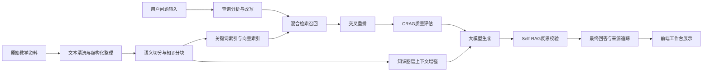

```mermaid
flowchart LR
    rawDocs[原始教学资料]
    cleanStage[文本清洗与结构化整理]
    chunkStage[语义切分与知识分块]
    indexStage[关键词索引与向量索引]
    userQuery[用户问题输入]
    rewriteStage[查询分析与改写]
    hybridStage[混合检索召回]
    rerankStage[交叉重排]
    cragStage[CRAG质量评估]
    llmStage[大模型生成]
    selfRagStage[Self-RAG反思校验]
    graphStage[知识图谱上下文增强]
    outputStage[最终回答与来源追踪]
    uiStage[前端工作台展示]

    rawDocs --> cleanStage --> chunkStage --> indexStage
    userQuery --> rewriteStage --> hybridStage --> rerankStage --> cragStage --> llmStage --> selfRagStage --> outputStage --> uiStage
    indexStage --> hybridStage
    graphStage --> llmStage
    chunkStage --> graphStage
```